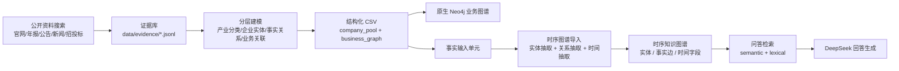
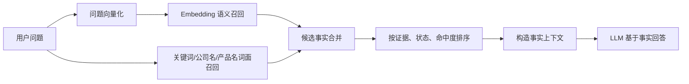

# 半导体图谱项目答辩文档

> 版本：2026-07-13  
> 范围：半导体产业链图谱 + 神州数码业务关系 + 图谱问答

## 1. 项目目标

本项目的目标不是单纯画一张半导体产业链图，而是把公开资料、证据、产业链环节、企业关系、神州数码业务关系和时间字段串成一套可追溯、可更新、可问答的知识图谱。

最终效果分成两层：

1. 原生业务图谱：用于展示半导体产业链、公司、产品服务、神州数码关系。
2. 时序图谱问答层：用于检索和问答，支持语义召回、词面补召回和时间推理。

---

## 2. 资料统计

### 2.1 结构化数据规模

| 模块 | 数量 |
|---|---:|
| 候选企业池 | 120 |
| 龙头企业判断 | 204 |
| 企业间关系 | 44 |
| L1-L4 产业链环节 | 34 |
| 产品/服务节点 | 102 |
| 公司-产品/服务关系 | 314 |
| 推定竞争关系 | 237 |
| 神州数码公开关系 | 19 |
| 覆盖企业总数 | 169 |

### 2.2 证据规模

| 证据文件 | 数量 |
|---|---:|
| `evidence_stage_1.jsonl` | 28 |
| `evidence_stage_2.jsonl` | 236 |
| `evidence_stage_3.jsonl` | 919 |
| `evidence_stage_4_relationships.jsonl` | 185 |
| `evidence_stage_7_digital_china.jsonl` | 14 |
| 合计 | 1382 |

说明：证据文件名中的 `stage` 是内部历史批次名，答辩时不作为业务建模流程讲解；对外统一使用 Layer 1-6 的建模层级。

证据等级分布：

| 等级 | 数量 |
|---|---:|
| A | 260 |
| A- | 50 |
| B | 130 |
| B- | 942 |

证据等级举例：

| 等级 | 判断口径 | 项目中的例子 |
|---|---|---|
| A | 官方或一手资料 | `E3-732` NVIDIA H100 Tensor Core GPU 官方产品页；`E3-733` AMD Instinct MI300 Series Accelerators 官方产品页；`E3-737` Google Cloud A3 machine series 官方文档 |
| A- | 权威第三方资料 | `E2-063` Global Pure Foundry Market Share: Quarterly；`E2-135` Worldwide Semiconductor Advanced Packaging Market Forecast and Analysis, 2025-2029；`E2-178` Global DRAM and HBM Market Share: Quarterly |
| B | 行业媒体、产业研究文章 | `E1-004` 吃透半导体 3 大核心产业链赛道；`E1-009` 先进封装市场规模预测分析；`E1-010` 先进封装产业链图谱及投资布局分析 |
| B- | 普通搜索结果、转载、弱来源 | `E2-003` EDA 概念拉升华大九天涨停；`E2-004` 今日头条转载类结果；`E2-007` 21IC 技术专栏类搜索结果 |

答辩口径：A 类可以作为强支撑，A- 可作为较强第三方支撑，B 类适合做行业背景和辅助判断，B- 更多用于初筛或补充线索，不能单独支撑关键结论。

### 2.3 图谱规模

| 图谱层 | 数量 |
|---|---:|
| 原生业务图谱节点 `SemiconductorKG` | 1487 |
| 原生业务图谱关系 | 3534 |
| 事实输入单元 | 818 |
| 抽取实体 | 1417 |
| 抽取事实边 | 1376 |

事实单元导入范围：

| 分组 | 数量 |
|---|---:|
| 龙头判断 | 204 |
| 企业关系 | 44 |
| 公司-产品关系 | 314 |
| 推定竞争关系 | 237 |
| 神州数码关系 | 19 |

### 2.4 问答评估

标准问答集：33 题。主验收指标：

| 模式 | Recall@8 | Hit@8 | Strict Hit@8 | MRR@8 |
|---|---:|---:|---:|---:|
| hybrid | 0.808 | 0.909 | 0.667 | 0.801 |
| lexical_only | 0.775 | 0.879 | 0.667 | 0.817 |
| semantic_only | 0.725 | 0.909 | 0.545 | 0.626 |

神州数码关系类在 hybrid 模式下 Recall@8 = 1.000。

---

## 3. 建模流程

答辩时不按历史文件名里的 `stage` 编号讲，因为这些编号只是数据补充过程中的内部批次。对外展示应按知识图谱建模逻辑讲：先定义产业链结构，再挂产品服务，再放企业主体和事实关系，最后接入神州数码业务关系与质量治理。

| 建模层 | 名称 | 目标 | 产出 |
|---|---|---|---|
| Layer 1 | 资料证据层 | 收集官网、年报、公告、新闻、招投标、行业报告等公开资料 | 证据 ID、来源 URL、来源等级、发布日期、检索时间 |
| Layer 2 | 产业分类层 | 建立半导体产业链 L1-L4 分类体系 | 上/中/下游、业务域、产业环节、细分产品服务环节 |
| Layer 3 | 企业实体层 | 按产业环节整理国内外候选企业和代表企业 | 企业主体、地区、所属环节、龙头/代表性判断 |
| Layer 4 | 事实关系层 | 建立企业与环节、产品服务、企业主体之间的关系 | 龙头属于环节、生产、销售、使用、采购、集成、供应、授权、代工、竞争候选 |
| Layer 5 | 业务关联层 | 将半导体产业链与神州数码 ICT/AI 基础设施业务连接 | 公开确认关系、潜在匹配、需内部验证关系 |
| Layer 6 | 时间与质量治理层 | 约束每条事实的可靠性、时效性和风险口径 | 数据截至时间、最近核验时间、置信度、证据等级、是否需要内部验证 |

内部 CSV 文件和 record_id 中保留 `stage3`、`stage6` 等字样，是为了兼容既有导入脚本和增量更新，不代表业务建模顺序。

---

## 4. 项目架构

### 4.1 原生业务图谱

原生图谱保留在同一个 Neo4j 实例中，主要用于可视化和业务分析。核心节点包括：

| 节点类型 | 含义 |
|---|---|
| 产业链层级 | 上游 / 中游 / 下游 |
| 业务域 | 设计支撑、制造支撑、封装测试、终端应用等 |
| 细分环节 | L4 产业链环节，例如 EDA 软件、晶圆代工、先进封装、AI 服务器 |
| 企业主体 | 半导体产业链相关公司 |
| 产品/服务 | 企业生产、销售、使用或集成的产品和服务 |
| 证据 | 支撑节点和关系的公开资料 |
| 神州数码 | 神州数码业务关系的中心主体 |

核心关系包括：

| 关系类型 | 含义 |
|---|---|
| 包含业务域 | 产业链层级包含某个业务域 |
| 包含细分环节 | 业务域包含某个 L4 细分环节 |
| 龙头属于环节 | 某家公司是某个环节的代表性或龙头企业 |
| 由证据支撑 | 某个判断或关系由公开资料支撑 |
| 包含产品服务 | 某个产业链环节包含某类产品或服务 |
| 生产 | 企业生产某产品或提供某服务 |
| 销售 | 企业销售某产品或服务 |
| 使用 | 企业使用某产品或服务 |
| 采购 | 企业采购某产品或服务 |
| 集成 | 企业集成某产品、服务或方案 |
| 供应给 | 企业之间存在供应关系 |
| 公开关系 | 公开资料支持的神州数码相关关系 |

### 4.2 时序图谱问答层

问答层不直接复用原始 CSV 节点，而是先把结构化事实转成“事实输入单元”，再由图谱引擎抽取：

- 事实输入单元：一条带证据和时间上下文的事实
- 实体节点：公司、产品、环节、关系对象
- 事实边：实体之间的可检索关系

这样做的原因是问答层需要自己的时间逻辑、去重逻辑和检索链路。

### 4.3 图谱问答层资料录入流程

图谱问答层基于 Graphiti 思路实现，但答辩时可以把它理解为项目中的“时序图谱问答模块”。它的资料录入流程如下：

| 步骤 | 处理内容 | 结果 |
|---|---|---|
| 1. 结构化事实整理 | 把龙头判断、企业关系、公司-产品关系、神州数码关系整理成事实输入单元 | 每条事实带有证据 ID、置信度、时间字段和限制说明 |
| 2. LLM 信息抽取 | 使用 LLM 从事实输入单元中抽取实体、关系、时间信息 | 企业、产品、环节、关系对象和事实边 |
| 3. 时间字段写入 | 把 `data_as_of`、`last_verified_at`、`event_start_at`、`event_end_at` 等字段写入事实上下文 | 支持后续按时间解释关系 |
| 4. 向量化表示 | 对事实文本、实体和关系生成 Embedding | 支持语义相似召回 |
| 5. 图数据库存储 | 把抽取出的实体、事实边、证据和时间信息写入 Neo4j | 形成可查询、可追溯、可问答的图谱 |

### 4.4 图谱问答流程

用户提问后，系统不是直接让大模型自由回答，而是先从图谱中召回相关事实，再把事实交给 LLM 生成答案。

召回上下文会保留：

- 事实文本
- 关系类型
- 证据 ID
- 数据截至时间
- 最近核验时间
- 当前有效性
- 是否需要内部验证
- 置信度和限制说明

因此回答会被约束在图谱事实内，避免把公开资料线索扩写成未经验证的客户关系或订单事实。

### 4.5 模型与运行环境

- LLM：DeepSeek
- Embedding：SiliconFlow
- 图数据库：Neo4j
- 图谱问答引擎：本地部署的时序图谱模块

---

## 5. 核心业务字段

### 5.1 通用时间与证据字段

这些字段在多数数据表中都存在，用来解决“资料什么时候来的、判断截至什么时候、关系是否还有效”的问题。

| 字段 | 含义 |
|---|---|
| `record_id` | 稳定记录 ID |
| `data_as_of` | 数据截至时间，表示这条判断对应哪一天的公开资料快照 |
| `first_seen_at` | 首次入库时间 |
| `last_verified_at` | 最近一次核验时间 |
| `event_date` | 明确事件日期 |
| `event_start_at` | 事件开始时间，只有公开资料明确写出才填 |
| `event_end_at` | 事件结束时间，只有终止、到期、停止合作等明确证据才填 |
| `time_precision` | 时间精度，如 day / month / year / unknown |
| `temporal_basis` | 时间依据，如 公告日期 / 证据发布日期 / 检索快照 / 未明确 |
| `source_publish_dates` | 证据发布日期 |
| `source_retrieved_dates` | 证据检索时间 |
| `current_validity` | 当前是否仍有效 |
| `claim_nature` | 断言性质，区分事实、推定、候选分析 |
| `primary_evidence_id` | 主证据 ID |
| `evidence_grade_summary` | 证据等级摘要 |
| `verification_method` | 核验方式 |
| `needs_refresh_after` | 建议下次复核时间 |
| `risk_note` | 风险提示 |

### 5.2 产业链与候选企业字段

这部分字段主要用于形成产业链基础和候选公司池，不是最终业务关系层，但它们解释了后续龙头判断从哪里来。

| 字段 | 含义 |
|---|---|
| `value_chain_layer` | 上游 / 中游 / 下游 |
| `major_segment` | 大业务域 |
| `subsegment_name` | 细分环节名 |
| `subsegment_role` | 该环节在产业链中的角色 |
| `company_name` | 候选企业名称 |
| `company_region` | 企业地区 |
| `evidence_ids` | 支撑候选判断的证据 ID |
| `source_urls` | 来源链接 |

### 5.3 龙头判断字段

| 字段 | 含义 |
|---|---|
| `value_chain_layer` | 上游 / 中游 / 下游 |
| `major_segment` | 大业务域 |
| `subsegment_name` | 细分环节名 |
| `subsegment_role` | 该公司在环节里的角色说明 |
| `company_name` | 公司名 |
| `company_region` | 公司归属地区 |
| `leader_level` | 全球龙头 / 国内龙头 / 细分龙头 / 需求端龙头 |
| `selection_basis` | 判断依据 |
| `evidence_ids` | 证据 ID 列表 |
| `evidence_count` | 证据数量 |
| `source_urls` | 来源链接 |
| `confidence` | 置信度 |
| `limitations` | 局限说明 |

### 5.4 企业关系字段

| 字段 | 含义 |
|---|---|
| `source_company` | 关系发起方 |
| `target_company` | 关系接收方 |
| `source_segment` | 发起方所属环节 |
| `target_segment` | 接收方所属环节 |
| `relationship_type` | 关系类型，如 晶圆代工 / 设备供应 / 先进封装 / IP授权 |
| `relationship_direction` | 关系方向 |
| `relationship_claim` | 关系描述 |
| `evidence_ids` | 证据 ID 列表 |
| `confidence` | 置信度 |
| `limitations` | 局限说明 |

### 5.5 L1-L4 与产品服务字段

`stage5_l1_l4_segments.csv`。文件名中的 `stage5` 是内部历史批次名；按建模逻辑，它属于 Layer 2 产业分类层。

| 字段 | 含义 |
|---|---|
| `l1` | 上 / 中 / 下游 |
| `l2` | 业务域 |
| `l3` | 环节层 |
| `l4_name` | 最细环节名 |
| `l4_code` | 环节编码 |
| `subsegment_role` | 角色说明 |
| `source_value_chain_layer` | 来源层级 |
| `source_major_segment` | 来源大类 |
| `source_subsegment_name` | 来源细分环节 |
| `is_focus_scope` | 是否属于当前重点范围 |

`stage5_product_services.csv`。文件名中的 `stage5` 是内部历史批次名；按建模逻辑，它属于 Layer 2 产业分类层。

| 字段 | 含义 |
|---|---|
| `product_service_id` | 产品/服务 ID |
| `product_service_name` | 产品/服务名 |
| `category` | 分类 |
| `l4_code` | 对应 L4 编码 |
| `l4_name` | 对应 L4 环节 |
| `definition` | 定义 |
| `is_controlled` | 是否受控词表 |

### 5.6 公司-产品 / 竞争字段

`stage6_company_product_relations.csv`。文件名中的 `stage6` 是内部历史批次名；按建模逻辑，它属于 Layer 4 事实关系层。

| 字段 | 含义 |
|---|---|
| `company_name` | 公司名 |
| `product_service_name` | 产品/服务名 |
| `relation_type` | 关系类型：`PRODUCES` / `SELLS` / `USES` / `PROCURES` / `INTEGRATES` |
| `l4_code` / `l4_name` | 对应产业环节 |
| `basis` | 判断依据 |
| `evidence_ids` | 证据 ID |
| `confidence` | 置信度 |
| `requires_internal_validation` | 是否需要内部数据验证 |
| `derivation` | 推导方式 |

`stage6_company_competition.csv`。文件名中的 `stage6` 是内部历史批次名；按建模逻辑，它属于 Layer 4 事实关系层。

| 字段 | 含义 |
|---|---|
| `source_company` | 公司 A |
| `target_company` | 公司 B |
| `relationship_type` | 竞争类型 |
| `basis` | 判断依据 |
| `evidence_ids` | 证据 ID |
| `confidence` | 置信度 |
| `requires_internal_validation` | 是否需要内部验证 |
| `对称关系` | 是否对称关系 |

### 5.7 神州数码关系字段

| 字段 | 含义 |
|---|---|
| `company_name` | 外部公司名 |
| `relationship_status` | 关系状态：`confirmed_public_relationship` / `needs_internal_validation` / `potential_fit` |
| `relationship_type` | 关系类型 |
| `relationship_basis` | 判断依据 |
| `asset_tier` | 客户资产层级 |
| `evidence_ids` | 证据 ID |
| `confidence` | 置信度 |
| `requires_internal_validation` | 是否需要内部确认 |
| `limitations` | 局限说明 |

---

## 6. 项目亮点

1. **产业链粒度适配业务分析。** 图谱不是停留在上游/中游/下游，而是细化到 L1-L4，再继续挂产品/服务、企业和证据。
2. **产品服务层适配销售和方案语境。** 通过 AI 服务器、GPU 服务器、数据中心交换机、存储设备、云基础设施服务等产品/服务节点，把产业链认知转成可讨论的业务对象。
3. **企业关系类型更贴近真实业务。** 关系不只写“合作”，而是区分生产、销售、使用、采购、集成、供应给、公开关系等类型。
4. **神州数码关系保持业务审慎口径。** 图谱区分公开确认、潜在匹配、需要内部验证，避免把公开线索说成内部客户或订单。
5. **证据和置信度可追溯。** 每条关键判断都保留证据 ID、证据等级、置信度和局限说明，便于答辩时解释“为什么这么连边”。
6. **时间字段适配后续更新。** 通过数据截至时间、首次入库时间、最近核验时间、事件开始/结束时间，支持后续持续更新和时序分析。
7. **问答召回适配中文业务问题。** 语义召回负责理解问题含义，词面召回负责命中公司名、产品名、缩写和中文环节名，降低漏召回。
8. **可视化和问答共同服务业务判断。** Neo4j 负责看关系结构，问答层负责把图谱事实转成可解释答案。

---
